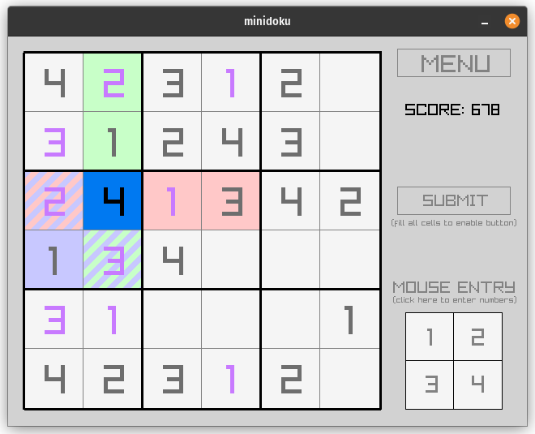

# Minidoku

This is a small and simple Sudoku-like game which should only take one to two minutes per round.

This game was made for my YouTube channel which focuses on development for modern retrocomputing platforms like the X16 and the F256.

If you enjoyed this game, please check out my channel and perhaps watch the video detailing its development:

https://youtube.com/@modernretrodev

This game is provided free (as in beer), enjoy!

## How to Play
You must fill in the missing numbers of the puzzle such that each 4x4 box contains numbers 1 thru 4. Additionally, each 4-cell row must also contain numbers 1 thru 4. Similarly, each 4-cell column must contain numbers 1 thru 4.

It is important that no number is repeated within a 4x4 block, 4-cell row, or 4-cell column.

Cell shading will indicate the bounds of the 4x4 blocks, the 4-cell rows, and the 4-cell columns.

Once all missing cells are filled in activate the submit button to check if your answers are correct.

## Controls
Minidoku can be played either using the keyboard, mouse, or XBOX-style gamepad (or a combination thereof). The controls for these inputs are as follows:

### Keyboard Controls
* Arrow Keys - Move (up/down/left/right)
* 1/2/3/4 - Enters a value into an empty cell
* Enter - Activate Option / Submit filled puzzle
* Backspace/Delete - Clear value within a cell
* Escape - Return to menu from within game

### Mouse Controls
* Left Click - Activate option / Select cell
* Right Click - Clear value within a cell
* Mousewheel - Cycle through numbers

### Gamepad Controls
* DPAD/Left-Stick - Move (up/down/left/right)
* A/X - Activate option / Cycle through numbers
* B - Clear value within a cell
* Y - Submit filled puzzle
* MENU - Return to menu from within game